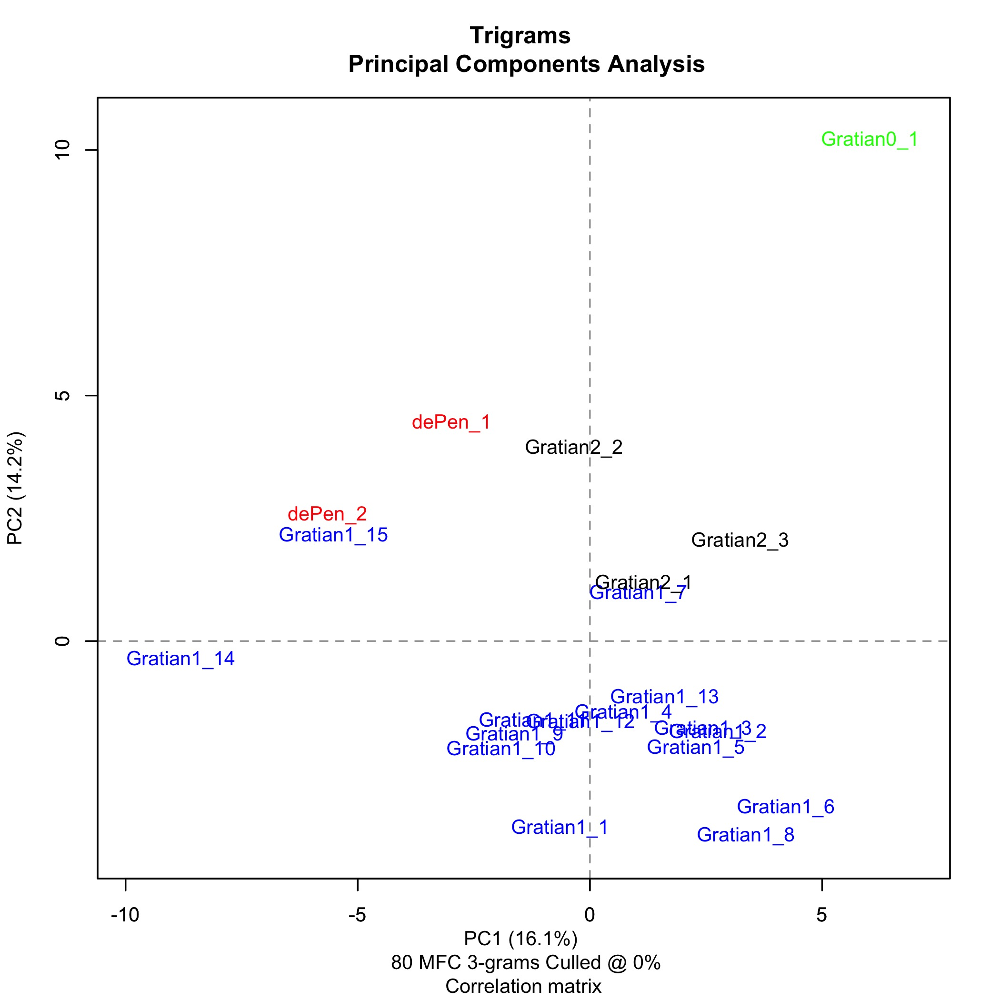

# Ngrams

Principal component analysis (PCA) on the basis of character n-gram
frequencies is an alternative to PCA on the basis of word or lemma
frequencies. This technique involves breaking words down into
constituent substrings of fixed length (n-grams), typically two or three
letters (bigrams or trigrams). The string “Gratian” broken down into
bigrams would be “gr”, “ra”, “at”, “ti”, “ia”, “an”, and broken down
into trigrams would be “gra”, “rat”, “ati”, “tia”, “ian” (strings are
lower-cased before being split into bigrams or trigrams). After breaking
the text down into character bigrams or trigrams, PCA is then performed
on the frequencies of the bigrams or trigrams in exactly the same way as
it would be on word or frequencies. Some practitioners of stylometric
analysis have conjectured that PCA on the basis of n-grams may be
particularly effective at capturing stylistic features (e.g., word
endings) of highly inflected languages like Latin.[1]

There is justification in the academic literature of psycholinguistics
to give an account for why stylometry based on the frequencies of
function words works, i.e., the claim, supported by experimental
evidence, that both writers and readers process function words at a
subconscious level. There is on the other hand no good theoretical
justification for stylometric analysis on the basis of bigrams and
trigrams Traditional scholars who are dubious at best about the
methodological justifiability of principal component analysis (PCA) on
the basis of word or lemma frequencies are therefore unlikely to be
persuaded by an attribution of authorship of a text exclusively on the
basis of character n-gram frequencies.

The absence of theoretical justification notwithstanding, there has been
at least one notable and well-received attribution of authorship of a
medieval text, *Beowulf*, based on PCA of n-gram frequencies. In a 2019
paper, Neidorf, Krieger, and Yakubek present the statistical frequency
of character bigrams in the text as stylometric evidence “consistent
with the unitary authorship of *Beowulf*.”[2] The article’s finding that
*Beowulf* is the product of unitary authorship supported an argument
advanced by JRR Tolkien in the 20th century, and the study therefore
attracted a significant amount of coverage from non-specialist
publications in addition to scholarly attention.

Kestemont, *et al.*, avoided using character n-grams in their analysis
of the letters of Hildegard of Binge, Guibert of Gembloux, and Bernard
of Clairvaux on the grounds that the method is highly sensitive to
orthographic inconsistencies in the sample texts. This concern does not
arise in the analysis of the *dicta* from Gratian’s *Decretum*, since
all of the text samples are the work of a single editor, Emil Friedberg,
and are therefore highly (although not perfectly) consistent with
respect to orthography.

[1] Spaces between words count for the purpose of decomposing a text
into its constituent n-grams. It is therefore immediately apparent which
n-grams represent inflectional endings in a sample of Latin text. “um”,
“us”, “is”, “tur”, “ur”, “et”, “em”, “it”, “am”, and “ent” are all in
the top twenty n-grams generated by the decompostion of the *dicta* from
Gratian’s *Decretum* into trigrams.

[2] Neidorf, L., Krieger, M.S., Yakubek, M. et al. Large-scale
quantitative profiling of the Old English verse tradition. Nat Hum Behav
3, 560–567 (2019). https://doi.org/10.1038/s41562-019-0570-1
